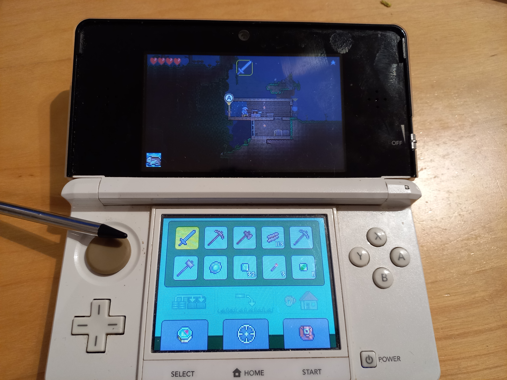

# 2024_WA_INF1_STEINER_PYTHON
## Obecně
Tento repozitář složí k práci s pythonem, ale momentálě se spíše zaměřuje na boj s Djangem.

Jednoho krásného večera jsem si řekl, že vypracuji malou wikipedii pro Terrarii, odtuď název Lite terraria wiki. Toto téma jsem si vybral z důvod, že jsem hru Terrarii už odehrál skoro na všem. Od mobilu, po počítač s klávesnicí a myší, také počítač s gamepadem (protože nemám na xbox ani na ps, fňuk, fňuk), a také jsem sehnal i cartridge pro své 16 let staré Nintendo 3DS. 

Zde je můj run :-D

## Doslovné zadání
Django projekt
Navrhněte a vytvořte základ CMS (Content Management System) v Django s následujícími požadavky:

- Alespoň tři modely (například Článek, Rubrika, Autor) a vazby mezi těmito modely - alespoň **1x vazba typu 1:N** a **1x vazba M:N**.
- Aplikace bude mít homepage s vybraným obsahem a odkazy na podstránky (například rubriky, nejnovější články, autoři apod.) a dále stránku "detailu" pro každý ze tří modelů (například detail článku, rubrika, autor), přičemž mezi těmito stránkami a homepage bude možné proklikávat (například ze článku povede odkaz na stránku autora obsahující všechny články autora, nebo na rubriku obsahující všechny články v rubrice). Stránky implementujte jako šablony v DLT s použitím dědičnosti (`extends`, `block` a/nebo `include`).
- Můžete použit CSS framework Tailwind nebo Bootstrap
- Proveďte základní konfiguraci pro Django Admin rozhraní.
- V projektu budou zahrnuty fixtures s ukázkovými daty, kterými bude možné aplikaci naplnit (pomocí `python manage.py loaddata ...`).
- Vytvořte a napište soubor `README.md` s informacemi o repozitáři a stručném představením projektu, významu jednotlivých modelů a vztahů mezi nimi.
- Vytvořte soubor `requirements.txt` se všemi balíčky, které projekt potřebuje.
- Projekt umístěte v kořenovém adresáři vašeho repozitáře `..._python` (soubor `manage.py` je přímo v kořenovém adresáři).

CMS může (**měl by mít**) mít jakoukoliv jinou ekvivalentní variantu, například knihovna (s modely například Kniha, Autor, Žánr), databáze filmů (Film, Herci, Režisér, Žánr), oblíbených míst (Místo, Kontinent, Kategorie), databáze her nebo jejich recenzí, hudební databáze apod..

Dbejte na originalitu, kreativitu a nápaditost aplikace, která bude součástí hodnocení!

## Architektura
V mém projektu jsou momentálně 3 modely.

**Article:**
___

Podává infromace o enemákovi, zvířeti, zbrani, ...

Informace jsou:

 - Zákldní parametry
 - Kategorie
 - Další informace
 - Obrázek
 - Výroba
 - Biom
 - Verze

 **Kategorie:**
___

Říká o objektu, co je za kategorii, například Piraň je v kategorii *Enemák*, *Ryba* a zároneň *Zvířátko*.

S modelem article má vazbu `N:M`.

 **Biom:**
___

Zděluje do jakého biomu objekt patří

S modelem article má vazbu `1:N`.

## Suma sumárum
 - Nevím, už mi došly nápady... 

## Konečné údaje
 - Obsah této složky **2024_WA_INF1_STEINER_PYTHON**, vznikal v roce 2024/2025 díky **Adamovi Steinervi**, žáku 3.E, vytvořena na pokyn **učitele Kamila Foltina**. 

Vyrobeno 09.02.2025, upraveno 09.02.2025

